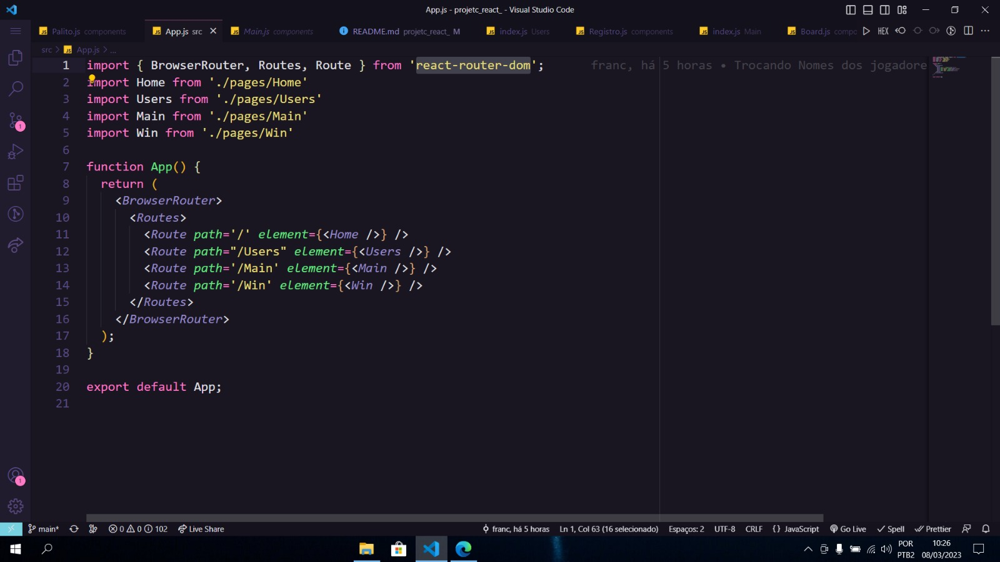
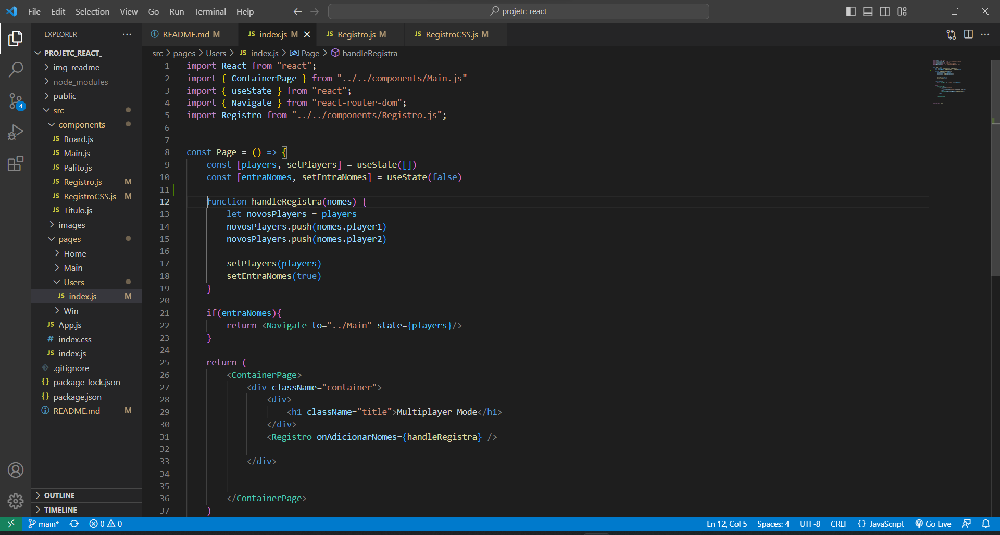
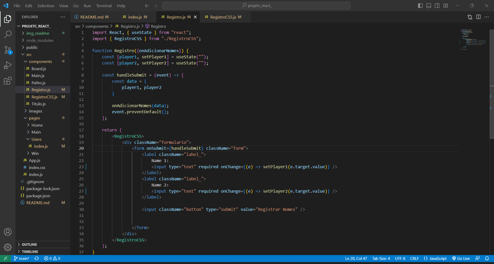
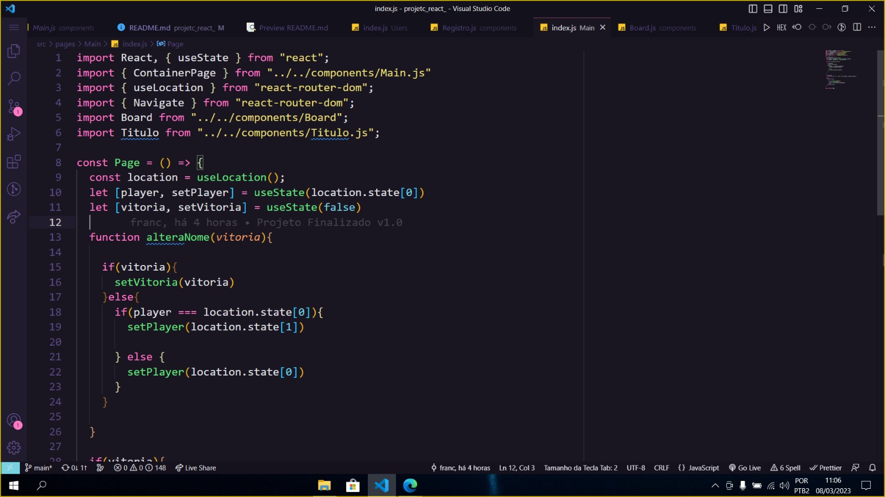
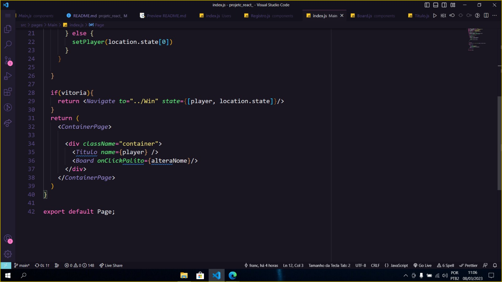
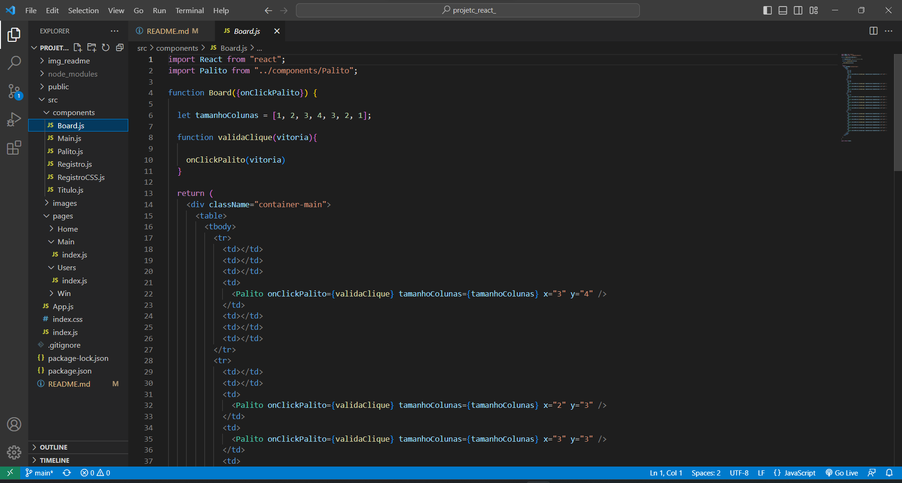
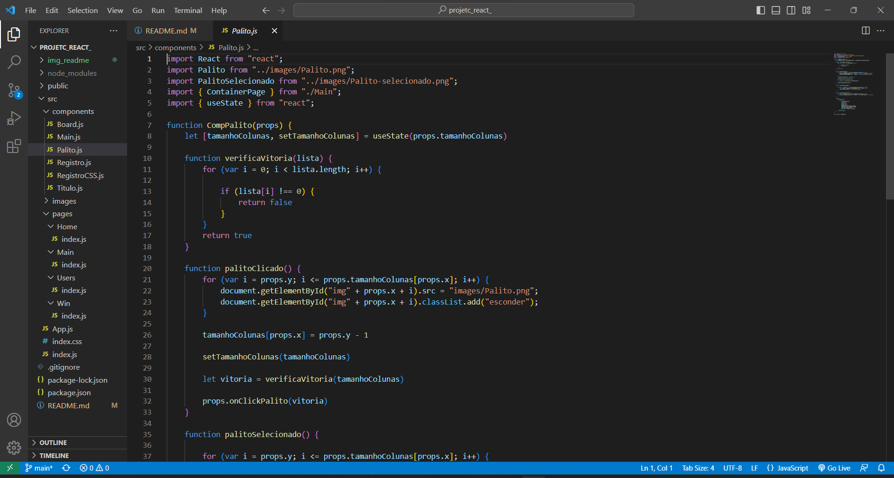
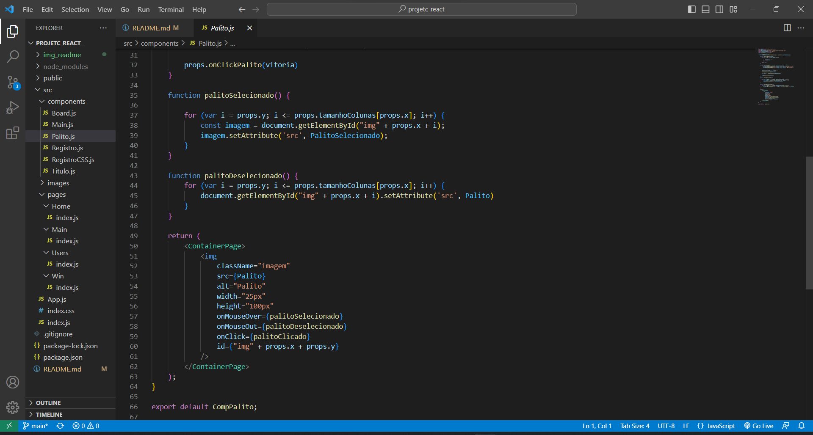
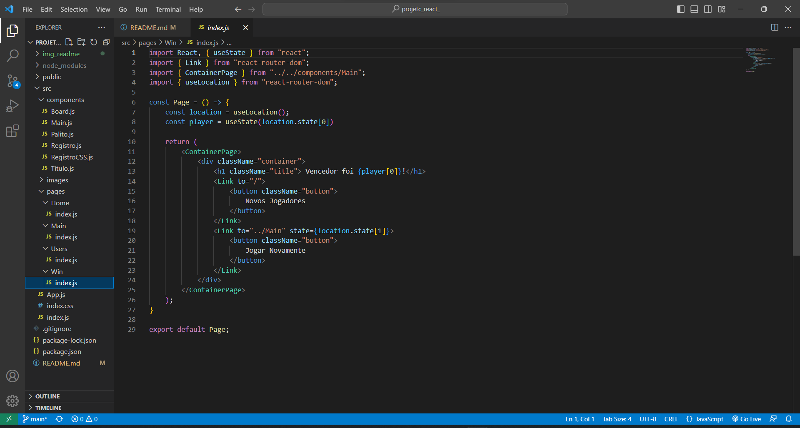

# :fire: Relato de Implementação
O projeto a seguir é uma implementação do Jogo NIM em React.

- [1. Descrição do Objetivo](#descricao)
- [2. Softwares Necessários](#softwares)
- [3. Passo-a-Passo](#passo)
  - [3.1 Home](#home)
  - [3.2 Users](#users)
  - [3.3 Main](#main) 
  - [3.4 Win](#win) 

___

<h1> Descrição do Objetivo </h1>

O Objetivo deste projeto é mostrar que o React facilitou a implementação de algumas funcionalidades do Jogo NIM. A dinâmica de implementação em SPA faz com que não tenhamos que nos preocupar com certos aspectos.

___

<h1>Instalação dos softwares necessários</h1>

### 1. Pra utilizar o ambiente de execução deste projeto

Primeiramente, clone o repositório para sua máquina e acesse através de algum 
 
[Clique aqui para instalar o node](https://nodejs.org/en/)

 
Após instalar o node, digite no terminal de comando: `npm install react-scripts --save`

*Finalizando a instalação do pacote, digite: `npm start`*
#### Pronto! 
Imediatamente o ambiente de execução irá abrir em seu localhost. 

### 2. Pra iniciar um projeto
Antes de mais nada, instale o Node.js em sua máquina. 
 
[Clique aqui para instalar o node](https://nodejs.org/en/)

Abra o terminal de alguma pasta desejada e digite:
~~~
npx create-react-app
~~~

Com isso todas as dependencias são instaladas, posteriormente, caso você precise de alguma outra, deverá instalar manualmente. 

Agora basta começar o seu projeto! 
Para ir ao ambiente de execução do browser, faça o passo 1.

___

<h1> Passo-a-passo para o desenvolvimento </h1>

Depois de iniciado o projeto (Mostrado no passo anterior), iniciamos a produção do nosso Game.

<h2>1. Home</h2>

Como a primeira renderização é feita no App.js, nos fizemos todos os componentes desta página voltado para o roteamento entre as páginas, ou seja, a navegação das páginas em si.

Foi importado a biblioteca react-router-dom juntamente com os componentes BrowserRouter que serve para poder rotear dentro dos navegadores, o Router aonde é necessário o seu uso porque todos os roteamentos serão feitos dentro dele e o ultimo o Route, que são as páginas que nos vamos mudar. Para fazer essa alteração é necessário importar todas as páginas que vão acontecer o roteamento, neste caso, as páginas Users, Main, Win e a Home que está referenciada como primeira página, então apenas o "/" está sendo descrito para referencia-la.

Foi criada a primeira página chamada "Home", aonde está contido o titulo e o botão para começar o jogo. 

 
  
Já conseguimos notar que foi importado algumas dependências, como por exemplo: "import React from "React"", que irá transpilar o código que foi escrito em objetos react sendo necessário a sua importação. Além desta, importamos também a formatação CSS para o design da página, construido dentro, também, de um arquivo JS, e usado como componente. 

A próxima importação, tem relação com a logo que foi usada no primeiro botão. Para poder pegar esta logo, foi necessário baixar a dependência "react-icons". Através dela podemos escolher uma categoria de icones e usa-los como componente juntamente com as suas propriedades dentro do JSX. 

Para poder navegar entre as páginas foi necessário importar a biblioteca, ou a dependência, react-router-dom. Dentro desta dependência nos usamos o componente Link para quando o botão for clicado, ele nos levar para o diretório Users. 

Dentro ainda desta primeira parte, foi criado também a página de CSS citada acima, com o nome de ContainerPage. 
Olhando para este componente, foi necessário baixar uma nova dependência chamada "style-componentes", que é usada para poder usar códigos CSSs dentro do JavaScript. 

Logo em seguida foi exportado o componente com o nome ContainerPage passando a personalização para dentro de uma div.

<h2> 2. Users </h2>

Este componente ( Page ) será, na prática, um formulário que recebe o nome dos jogadores e que redireciona para o componente ( Page ) do jogo. 

Para trabalhar com Formulários de forma mais prática o react disponibiliza a função **`useState`**, que importamos no inicio do arquivo. 

Em seguida, pode-se observar o **`Navigate`**, componente da biblioteca **React-router-dom**, ajuda a navegar pelas páginas setadas como rotas no arquivo App.js, já citado anteriormente. 

Optamos por implementar o form como um componente do nosso app, apelidamos de **`Registro`**, devemos importa-lo para utiliza-lo.

O **`useState`** é o que chamamos de React Hook, podemos usa-lo para trazer a funcionalidade dinÂmica da página, ou seja, criamos um estado que será dinamico e sempre que for setado, será alterado na página caso esteja sendo usado.
No Users, temos dois estados: **`players`** e **`entraNomes`**. 
Perceba que ambos tem valores padrões que são atribuidos na função useState. As funções set que acompanham esses estados serão responsáveis por modificar as variáveis e trazer a dinamicicidade. 

Função **`HadleRegistra()`**: Essa função irá alterar o estado da lista de players para os valores adquiridos dentro do Formulário e mudará o **`entraNomes`** para **true**, permitindo assim que façamos a navegação para a próxima página caso os valores sejam corretamente fornecidos. 

Função **`return()`**: O que será mostrado na page, perceba que passamos um parâmetro para o componente registro, entregamos a função de **`HandleRegistra()`** e assim iremos setar o estado players na página users através do componente **`Registro`**.

#### 2.1 Componente Registro

O componente registro se encontra dentro da page users, portanto iremos explica-lo aqui. 

Ele inicia recebendo o parâmetro, que é a função para manipular o state do Users. 

Temos dois states, **`player1`** e **`player2`**, para recebermos o valor de cada input. 
Usamos o evento onChange para receber o nome digitado em cada campo. 
Ao executar o submit, criamos uma lista com ambos os nomes e enviamos à função  **`HandleRegistra()`** do users, para atualizarmos os estados. 

<h2> 3. Componente Main </h2>

Esta é a classe principal do nosso projeto, é nela que ocorrerá a interação e execução do game.

Já explicamos alguns imports existentes nela, então passaremos para os novos: **`useLocation`**.

**`useLocation`** : permite identificar o location, pathname, state de qualquer componente; Como você já pode imaginar, utilizamos ele pois passamos uma propriedade `state` no **Navigate** da página Users ( Line 22 ) e queremos saber o valor passado para ela. 

Iniciamos a Page atribuindo a state através da função location, e pegando o state fornecido anteriormente. Esse será o player atual que está jogando. 
O segundo state é apenas para guardar caso a vitória tenha sido satisfeita. 

Function **`alteraNome()`**: Essa função irá alterar do Jogador1 para o Jogador2, e em caso de vitória, apenas irá setar o State Vitória. Caso **`vitoria`** seja **true**, então iremos para a página de vitória e não entraremos na função return padrão novamente. 

#### 2.1 Componente Board

Esse componente se trata do Container em que o tabuleiro de palitos estará sobreposto. O tabuleiro foi feito através de tabela.
Armazenamos o numero de linhas em cada Coluna e atribuimos um Id para cada palito para facilitar a lógica de programação.

Perceba que ele recebe um parâmetro **`onClickPalito`**, que é a função do Main que testa a vitória. Nós pegamos o state vitória do palito, que será true ou false, em seguida enviamos ao board, que por sua vez envia ao Main. Cada Clique executado gera um teste de vitória. 

Para o componente Palito passamos diversas properties, que serão usadas para a lógica de programação. Properties são parâmetros que você nomeia na hora da chamada do componente e define um valor. Para recebe-los basta colocar o componente recebendo **props** como parâmetros ( É necessário que seu componente esteja em paradigma funcional ).

#### 2.2. Componente Palito

Aqui acontece uma boa parte da lógica de programação, já que o nosso Game gira em torno dos palitos. Não creio que caiba explicar a lógica, então vamos para o React. 

Podemos perceber logo de cara que precisamos importar as Imagens e não somente chamar os Caminhos delas nas tags. 

O Componente Palito irá retornar uma imagem do palito com os atributos setados. Iremos manipular os eventos dentro do próprio Componente: (onMouseOver, onMouseOut, onClick). 

A cada Clique testaremos a vitória, e em caso de vitória enviaremos isso até o main, caso contrário, apenas continuamos escondendo os Palitos. 

Ao finalizar, vamos a última página. 

<h2> 4. Componente Win </h2>

A última página: recebemos o player vencedor através do state, receptado pelo useLocation. 
Há Dois botões que estão dentro da tag Link.
Essa Tag é também do **`react-router-dom`**, e é responsável por linkar um objeto á outra página, assim, quando clicarmos, seremos redirecionados á ela. 

O Primeiro botão retorna á página inicial e o segundo volta para o board e reinicia o Jogo. 

