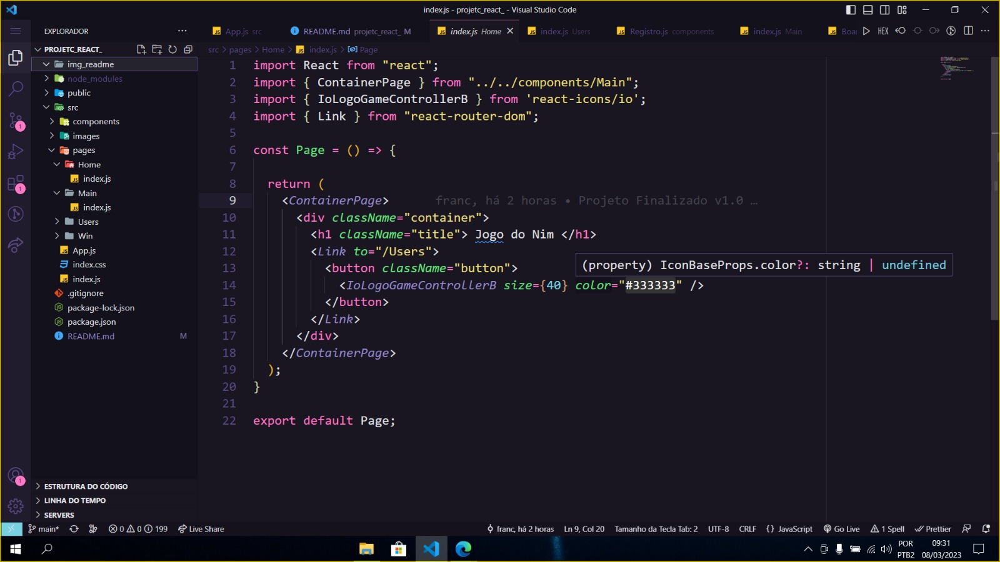
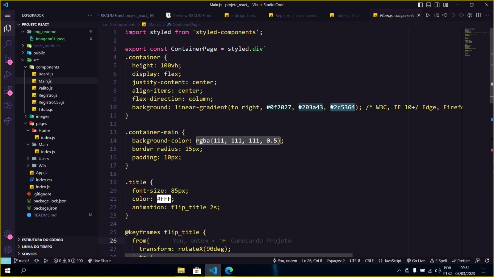

# :fire: Relato de Implementação
O projeto a seguir é uma implementação do Jogo NIM em React. 
___
## Descrição do Objetivo
O Objetivo deste projeto é mostrar que o React facilitou a implementação de algumas funcionalidades do Jogo NIM. A dinâmica de implementação em SPA faz com que não tenhamos que nos preocupar com certos aspectos.
___
## Instalação dos softwares necessários
### 1. Pra utilizar o ambiente de execução deste projeto

Primeiramente, clone o repositório para sua máquina e acesse através de algum 
 
[Clique aqui para instalar o node](https://nodejs.org/en/)

 
Após instalar o node, digite no terminal de comando: `npm install react-scripts --save`

*Finalizando a instalação do pacote, digite: `npm start`*
#### Pronto! 
Imediatamente o ambiente de execução irá abrir em seu localhost. 

### 2. Pra iniciar um projeto
Antes de mais nada, instale o Node.js em sua máquina. 
 
[Clique aqui para instalar o node](https://nodejs.org/en/)

Abra o terminal de alguma pasta desejada e digite:
~~~
npx create-react-app
~~~

Com isso todas as dependencias são instaladas, posteriormente, caso você precise de alguma outra, deverá instalar manualmente. 

Agora basta começar o seu projeto! 
Para ir ao ambiente de execução do browser, faça o passo 1.

## Passo-a-passo para o desenvolvimento

Depois de iniciado o projeto (Mostrado no passo anterior), iniciamos a produção do nosso Game.
Foi criada a primeira página chamada "Home", aonde está contido o titulo e o botão para começar o jogo. 

 
  
Já conseguimos notar que foi importado algumas dependências, como por exemplo: "import React from "React"", que irá transpilar o código que foi escrito em objetos react sendo necessário a sua importação. Além desta, importamos também a formatação CSS para o design da página, construido dentro, também, de um arquivo JS, e usado como componente. 

A próxima importação, tem relação com a logo que foi usada no primeiro botão. Para poder pegar esta logo, foi necessário baixar a dependência "react-icons". Através dela podemos escolher uma categoria de icones e usa-los como componente juntamente com as suas propriedades dentro do JSX. 

Para poder navegar entre as páginas foi necessário importar a biblioteca, ou a dependência, react-router-dom. Dentro desta dependência nos usamos o componente Link para quando o botão for clicado, ele nos levar para o diretório Users. 

Dentro ainda desta primeira parte, foi criado também a página de CSS citada acima, com o nome de ContainerPage. 
Olhando para este componente, foi necessário baixar uma nova dependência chamada "style-componentes", que é usada para poder usar códigos CSSs dentro do JavaScript. 

Logo em seguida foi exportado o componente com o nome ContainerPage passando a personalização para dentro de uma div.

